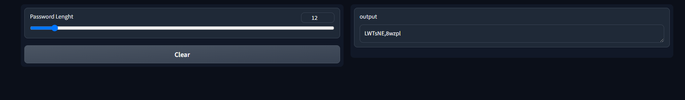

# Quantum-Powered-Password-Generator :closed_lock_with_key::sparkles:

## Description :star2:
This is a project that allows you to generate random passwords through the use of quantum computing. Using quantum circuits, it produces randomly created results based on quantum phenomena such as quantum superposition and quantum measurement. This allows your passwords to be generated with more randomness and unpredictability.

## Why Quantum? :thinking
Determination algorithms are used by classical computers to generate random numbers. Such algorithms are formulated from predetermined procedures and are normally predictable or replicable. This creates a flaw in password security because attackers can potentially possess an algorithm that could predict such "random" numbers.

In contrast, quantum computing leverages the randomness of quantum mechanics to generate numbers. These numbers are completely random. Two of the fundamental principles utilized by quantum computing are:

### Quantum Superposition:
A qubit can exist in multiple states at the same time, whereas classical bits can exist in only 0 or 1. This makes the randomness of the measured qubits more complex and adds more randomness.

### Quantum Measurement:
When the qubits are measured, they get collapsed into a value (0 or 1). The measurement outcome is completely random and nondeterministic and, as a result, every cipher that is generated becomes purely unpredictable.

Generation of passwords through quantum computing allows you to generate passwords much more secure and random than using traditional methods.

### True Randomness:
Unlike traditional RNGs, quantum randomness prevents passwords from being guessed in any shape or form and will never exhibit patterns.

### Flexible Length:
You can configure the password length through the interface or API.

### Secure and Random:
Quantum-derived passwords are significantly more secure and random than classical approaches.

## How it works :gear:
### Quantum Circuitry
Quantum circuit is the base of the password generation process. In this circuit, superposition is created by applying a Hadamard gate over qubits and measuring them.

### Measurement:
When the qubits are measured, the value collapses to an arbitrary one and a binary sequence is obtained.

### Password Mapping:
This binary code is mapped onto a character set (the alphabets and numbers in both upper and lower case and special characters) and a secure password is generated.

This process generates secure, random passwords by exploiting the inherent randomness of quantum mechanics.

## Features and Benefits :shield:
### Quantum Level Security:
Quantum-based randomness is used to render passwords unguessable as well as reverse engineering-proof.

### Flexible Interface:
The password generator can be accessed either through the Flask API or the Gradio Interface.

### Wide Character Range:
Ciphers have a wide character range, including letters, numbers and special characters such as *, &, #.

## How to Run :rocket:
### Install Dependencies:
```bash
pip install qiskit gradio flask
```

## How to Use :rocket:

### 1. Using the API:
You can generate a random password by sending a GET request to the following URL:

```bash
http://127.0.0.1:5000/generate_password?length=15
```

In the example above, the password length is set to 15. You can adjust the length by modifying the value of `length`.

### 2. Using the Gradio Interface:
Alternatively, you can generate passwords through the Gradio interface. Below is a screenshot of the interface where you can input the desired password length and get your random password.




